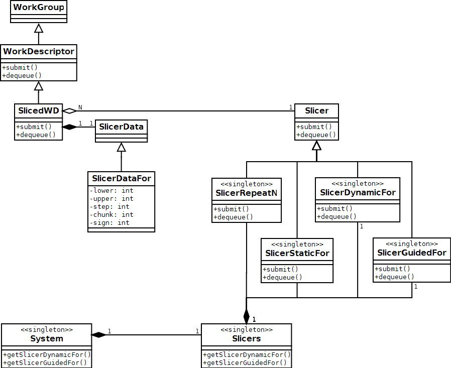

**Back to:** [README](../../README.md) > [developers guide](../developers_guide.md) >

Task Slicers implementation
===========================

SlicedWD
--------

A **SlicedWD** (aka *Sliced Work Descriptor*) is a specific class which derives
from **WorkDescriptor**. Main idea behind this class is to offer a mechanism
which allow to decompose a WorkDescriptor in a set of several WorkDescriptors.
Initial version of this mechanism implements the following diagram:

A **SlicedWD** will be always related with:

* a **Slicer**, which defines the work descriptor behaviour.
* a **SlicerData**, which keeps all the data needed for splitting the work.

Slicer objects are common for all the SlicedWD of an specific type. In fact,
the Slicer object determines the type of the SlicedWD. In the other hand,
SlicerData objects are individual for each SlicedWD object.

This mechanism is implemented as a derived class from **WorkDescriptor**: the
**SlicedWD**. A **SlicedWD** overrides the implementation of *submit()* and
*dequeue()* methods which have been already defined in the base class.

In the base class, `submit()` method just call `Scheduller::submit()` method
and `dequeue()` returns the WD itself (meaning this is the work unit ready to
be executed) and a boolean value (true, meaning that it will be the last
execution for this unit of work). Otherwise, derived class **SlicedWD**  will
execute `Slicer::submit()` and `Slicer::dequeue()` respectively, giving the
slicer the responsibility of doing specific actions at submission or dequeuing
time.

Slicer objects
--------------

Nanos++ defines several Slicer Objects. Each of them defines an specific
behaviour for `submit()` and `dequeue()` methods. We have currently implemented
the following Slicer Objects:

* **SlicerRepeatN**: Executes 'n' times the related WD.
* **SlicerStaticFor**: Used in worksharing loops with static policy. It also
  implements interleaved policy which is a specific case of the static policy
  with a given chunk.
* **SlicerDynamicFor**: Used in worksharing loops with dynamic policy.
* **SlicerGuidedFor**: Used in worksharing loops with a guided policy

